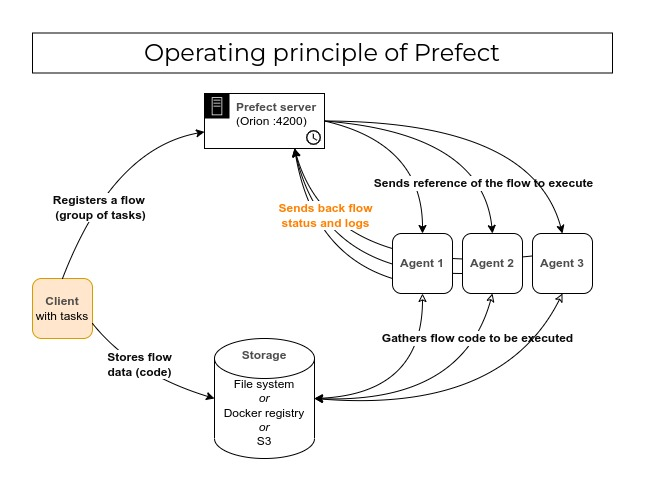

# Prefect - Docker Compose

A simple guide to understand and make Prefect work with your own docker-compose configuration.

This allows you to package your Prefect instance for Kubernetes or offline use.



- [Prefect - Docker Compose](#prefect---docker-compose)
  - [Run the server](#run-the-server)
  - [Run one or multiple agents](#run-one-or-multiple-agents)
  - [Run your first flow via the Prefect API](#run-your-first-flow-via-the-prefect-api)
    - [Principles to understand](#principles-to-understand)
    - [Flow on Local storage (recommended)](#flow-on-local-storage-recommended)
    - [Flow on S3](#flow-on-s3)
    - [Flow on Docker storage](#flow-on-docker-storage)

## Run the server

Open and edit the [`server/.env`](./server/.env) file.  
All `PREFECT_SERVER_*` options are [explained in the official documentation](https://docs.prefect.io/core/concepts/configuration.html#environment-variables) and [listed in the `config.toml` file](https://github.com/PrefectHQ/prefect/blob/master/src/prefect/config.toml).

Then you can run :

```bash
docker-compose -f server/docker-compose.yml up -d
```

Insert the following content in file `~/.prefect/config.toml` :

```conf
# ~/.prefect/config.toml
debug = true

# base configuration directory (typically you won't change this!)
home_dir = "~/.prefect"

backend = "server"

[server]
host = "http://172.17.0.1"
port = "4200"
host_port = "4200"
endpoint = "${server.host}:${server.port}"
```

Finally, we need to create a _tenant_. Execute on your host :

```bash
pip3 install prefect
prefect backend server
prefect server create-tenant --name default --slug default
```

Access the UI at [localhost:8080](http://localhost:8080)

## Run one or multiple agents

Agents are services that run your scheduled flows.

Open and edit the [`agent/config.toml`](./agent/config.toml) file.

> :information_source: In each `config.toml`, you will find the `172.17.0.1` IP address. This is the IP of the Docker daemon on which are exposed all exposed ports of your containers. This allows   containers on launched from different docker-compose networks to communicate. Change it if yours is different (check your daemon IP by typing `ip a | grep docker0`).
> 
> 
> 
> Here, mine is `192.168.254.1` but the default is generally to `172.17.0.1`.

Then you can run :

```bash
docker-compose -f agent/docker-compose.yml up -d
```

> :information_source: You can run the agent on another machine than the one with the Prefect server. Edit the [`agent/config.toml`](./agent/config.toml) file for that.

Maybe you want to instanciate multiple agents automatically ?

```bash
docker-compose -f agent/docker-compose.yml up -d --scale agent=3 agent
```

## Run your first flow via the Prefect API

### Principles to understand

> :speech_balloon: [Execution in your cloud; orchestration in ours](https://medium.com/the-prefect-blog/the-prefect-hybrid-model-1b70c7fd296)

This means the Prefect server never stores your code. It just orchestrates the running (optionally the scheduling) of it.

1. When coding a flow, you need first to [**register it** to the Prefect server](./client/weather.py#L44) through a script. In that script, you may ask the server to run your flow 3 times a day, for example.
2. Your code never lies on the Prefect server : this means the code has to be stored somewhere accessible to the agents in order to be executed.

    Prefect has [a lot of storage options](https://docs.prefect.io/orchestration/execution/storage_options.html) but the most famous are : Local, S3 and Docker.

    - Local : saves the flows to be run on disk. So the volume where you save the flows must be [shared among your client and your agent(s)](./client/docker-compose.yml#L9). Requires your agent to have the same environment than your client (Python modules, packages installed etc... (the same Dockerfile if your agent and client are containers))
    - S3 : similar to local, but saves the flows to be run in S3 objects.
    - Docker : saves the flows to be run as Docker images to your Docker Registry so your agents can easily run the code.

### Flow on Local storage (recommended)

:information_source: If your agents are installed among multiple machines, I recommend you to mount a shared directory with SSHFS.

Open the [`client/config.toml`](./client/config.toml) file and edit the IP to match your Prefect instance. Then you can run :

```bash
docker-compose -f client/docker-compose.yml up # Executes weather.py
```

Now your flow is registered. You can access the UI to run it.

### Flow on S3

:warning: I don't recommend this method if you plan to schedule a lot of flows every minute. MinIO times out regurarly in that case (maybe AWS wouldn't).

We will use [MinIO](https://www.github.com/minio/minio) as our S3 server.

```bash
docker-compose -f client_s3/docker-compose.yml up -d minio # Starts MinIO
```

Go to [localhost:9000](http://localhost:9000) create a new **bucket** named `prefect` by clicking the red "+" button bottom right.

Open the [`client/config.toml`](./client/config.toml) file and edit the IP to match your Prefect instance and S3 server endpoint. Then you can run :

```bash
docker-compose -f client_s3/docker-compose.yml up weather # Executes weather.py
```

Now your flow is registered. You can access the UI to run it.

### Flow on Docker storage

:warning: Client example only. The [agent](./agent) example in this repo doesn't include Docker in Docker for the moment, so it can't work with this client flow. You can inspire yourself from [the client's Dockerfile](./client_docker/Dockerfile) to create an agent able to execute Docker images.

This method requires our client AND agent containers to have access to Docker so they can package or load the image in which the flow will be executed. We use Docker in Docker for that.

Open the [`client_docker/config.toml`](./client_docker/config.toml) [`client_docker/docker-compose.yml`](client_docker/docker-compose.yml) files and edit the IP to match your Prefect instance. Then you can run :

```bash
docker-compose -f client_docker/docker-compose.yml up # Starts the Docker registry and executes weather.py
```

Now your flow is registered. You can access the UI to run it.
